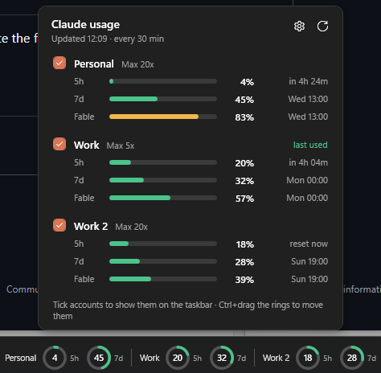
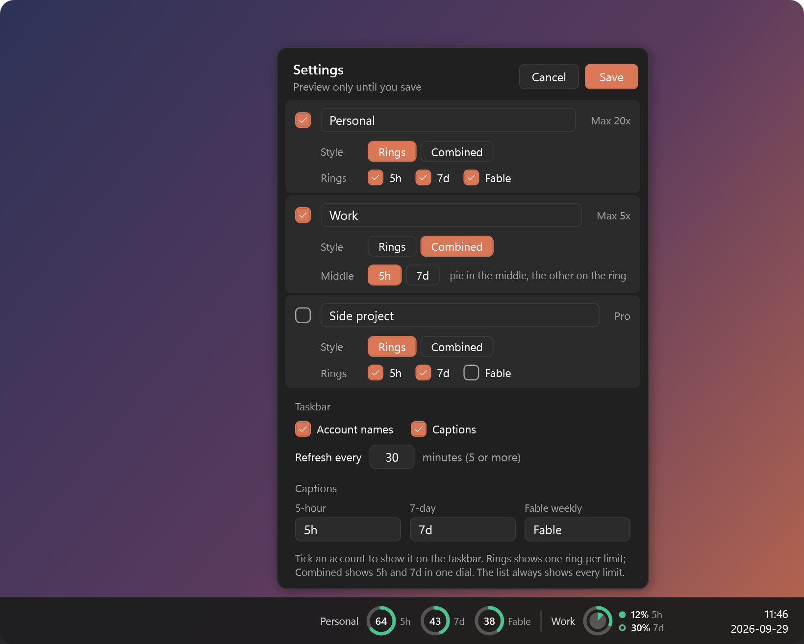

<div align="center">


# Claude Usage Widget for Windows 11

**Your Claude 5-hour, 7-day and Fable limits as small rings on the Windows 11 taskbar.**
One account or several, updated in the background, in one click.

[](#install)
[](#how-it-works)
[](LICENSE)



</div>

## Features

- **Rings on the taskbar.** Each ring is green up to 70%, amber up to 90% and red after that. Hover a ring for its reset time.
- **Multiple accounts.** Tick the accounts you want on the taskbar and they sit side by side, each with its name.
- **All limits in one click.** The list shows each account's 5-hour window, 7-day window and Fable weekly limit, with countdowns to the resets.
- **Finds your accounts.** On first run it picks up the Claude Code logins on your PC (and [xndr-claude](https://github.com/mrcsXndr/xndr-claude) accounts if you use it).
- **Settings you can edit.** Rename accounts, choose which rings each one shows, and rename the ring captions.
- **Stays out of the way.** Refreshes every 30 minutes, and at most once a minute however you trigger it. Catches up after sleep. Hides during full-screen apps. Follows the light or dark theme.
- **Nothing to install besides itself.** It's plain PowerShell and WPF, which ship with Windows, so there are no runtimes, services or admin rights involved.

## Install

Open **PowerShell** (press Start, type `powershell`, press Enter) and paste:

```powershell
irm https://raw.githubusercontent.com/mrcsXndr/claude-usage-widget/main/install.ps1 | iex
```

That's it. The rings appear on your taskbar, left of the clock, and they start with Windows from then on.

<details>
<summary>Prefer not to paste commands?</summary>

1. Click **Code → Download ZIP** at the top of this page and unzip it.
2. Double-click **`Install.cmd`**.

Running either one again updates you to the latest version and keeps your settings.
</details>

**Uninstall:** go to **Settings → Apps → Installed apps → Claude Usage Widget → Uninstall**.

## Use

| | |
| --- | --- |
| **Click** the rings | Open the account list |
| **Tick** an account | Show it on the taskbar |
| **⚙ Settings** | Rename accounts, choose each one's rings, rename captions |
| **⟳** | Refresh now (at most once a minute) |
| **Ctrl + drag** | Move the rings along the taskbar |
| **Right-click** | Refresh · Settings · Scan for accounts · Start with Windows · Exit |

<div align="center">

</div>

## Accounts

The widget finds accounts on its own:

- **Claude Code logins.** It reads `%USERPROFILE%\.claude\.credentials.json`, which is where Claude Code keeps its login on Windows. It also checks any other `.claude*` folder in your user profile (for example one per account set up with `CLAUDE_CONFIG_DIR`). Accounts are named after the email they're logged in with.
- **[xndr-claude](https://github.com/mrcsXndr/xndr-claude)** accounts, if it's installed.

After you log in to another account, right-click the rings and choose **Scan for accounts**. If the same account turns up twice, open ⚙ Settings and untick **In list** on one of them.

<details>
<summary>Other token sources (config file)</summary>

Everything is stored in `%APPDATA%\claude-usage-widget\config.json`. To open it, right-click the rings and choose **Open config file…**. Each account says where its token comes from:

```json
{
  "refreshMinutes": 30,
  "captions": { "5h": "5h", "7d": "7d", "fable": "Fable" },
  "accounts": [
    { "name": "claude-code", "label": "Personal", "source": "claude-code", "taskbar": true, "limits": ["5h", "7d", "fable"] },
    { "name": "work",  "label": "Work",  "source": "xndr-claude" },
    { "name": "vault", "label": "Vault", "source": "command", "command": "op read op://Private/claude/token" },
    { "name": "ci",    "label": "CI",    "source": "env", "env": "CLAUDE_CI_TOKEN", "fable": false }
  ]
}
```

| `source` | Where the token comes from |
| --- | --- |
| `claude-code` | Claude Code's login. Add `"dir"` for a config folder other than `~/.claude`. |
| `xndr-claude` | `xndr-claude token <name>`. Add `"account"` if the name there is different. |
| `command` | Whatever the command prints, for example a password manager CLI. |
| `env` | An environment variable. |

`"fable": false` makes that account skip the Fable probe (see below).
</details>

## How it works

For each account the widget asks Anthropic for the current limits. There are two ways to do that, and it tries the free one first:

1. **Usage API (free).** `GET api.anthropic.com/api/oauth/usage` returns every limit and doesn't use any of your allowance. This works for **Claude Code logins**.
2. **Probe (tiny).** Tokens made with `claude setup-token` aren't allowed to call the usage API ([anthropics/claude-code#81015](https://github.com/anthropics/claude-code/issues/81015)). For those, the widget sends a 1-token request and reads the limits from the rate-limit headers on the reply. It sends that request to Fable, because only then does the reply include the Fable weekly limit. That costs about 35 tokens per account per refresh. If Fable isn't available on an account, it uses Haiku instead.

Hover an account in the list to see which method it used.

**Claude Code logins expire.** The widget only ever reads the login and never renews it, because renewing would sign Claude Code out. If a login has expired, open Claude Code once and the widget picks up the new one.

## Privacy

- Tokens are kept in memory only as long as one request takes. They're never written to disk, logged, shown, or passed on a command line.
- The only network calls go to `api.anthropic.com`, plus `github.com` when you install or update.
- Settings are stored in `%APPDATA%\claude-usage-widget`. Uninstalling removes them. Your Claude logins are never touched.

## Troubleshooting

| | |
| --- | --- |
| **Rings don't appear** | Run the installer again. Errors are logged to `%APPDATA%\claude-usage-widget\widget.log`. |
| **"Login expired"** | Open Claude Code once so it renews the login. |
| **"token invalid"** | That token was revoked. Log in again, or make a new setup-token. |
| **Rings cover a tray icon** | Hold Ctrl and drag them somewhere else. |
| **Taskbar on another screen** | For now the widget sits on the main screen's taskbar only. |

## For developers

```powershell
.\ClaudeUsageWidget.ps1 -Demo          # made-up accounts, no network, your config untouched
.\ClaudeUsageWidget.ps1 -Once          # every account's usage as JSON, no UI (never includes tokens)
.\ClaudeUsageWidget.ps1 -Snapshot docs # re-render the README screenshots
.\tools\Build-Icon.ps1                 # re-render assets\icon.ico
```

| File | What it does |
| --- | --- |
| `ClaudeUsageWidget.ps1` | The widget: taskbar rings, account list, settings (WPF) |
| `lib/Usage.ps1` | Account discovery, token sources, usage API and probe, with no UI |
| `install.ps1` / `Install.cmd` / `uninstall.ps1` | Per-user install to `%LOCALAPPDATA%\Programs`, with Start menu, startup and Settings → Apps entries |

The code is kept ASCII-only so the Windows PowerShell 5.1 that ships with Windows reads it correctly. Pull requests are welcome.

## License

[MIT](LICENSE). This project isn't affiliated with Anthropic.
